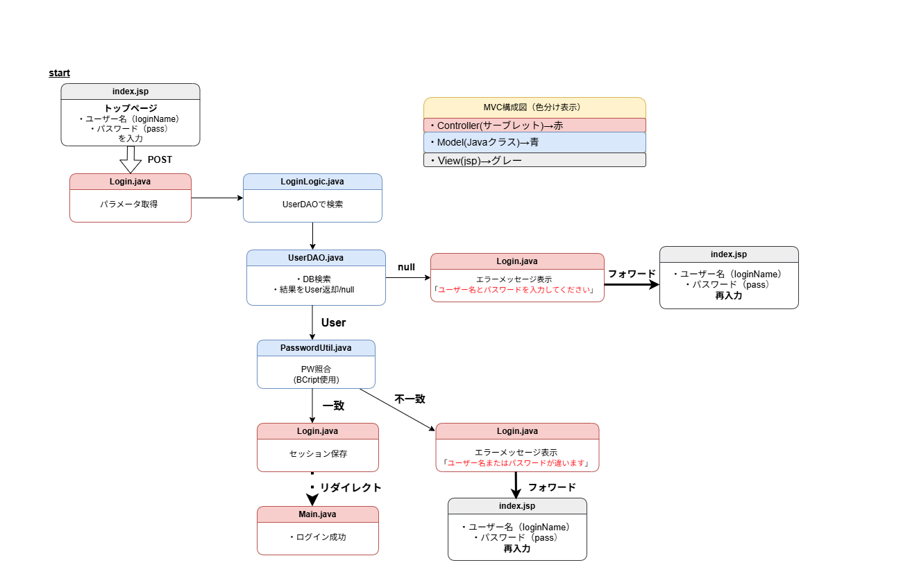

# ログイン処理設計書

## 1. 画面構成

| 画面名       | ファイル        | 説明                          |
|--------------|----------------|-------------------------------|
| トップページ | `index.jsp`    | ユーザー名・パスワードを入力する画面 |
| メインページ | `Main.java`    | ログイン成功後の遷移先        |

---

## 2. ログイン処理フロー（MVC構成）

**色分け情報：**  
- Controller（サーブレット） → 赤  
- Model（Javaクラス） → 青  
- View（JSP） → グレー  

### 2-1. 画面遷移図

※ 画像をクリックすると拡大表示されます。

---

## 3. 処理分岐詳細

| 処理           | 成功時                                         | 失敗時                               |
|----------------|----------------------------------------------|--------------------------------------|
| ユーザー認証   | Userオブジェクト取得 → セッションに保存 → `Main.java`へフォワード | null →  エラーメッセージ表示 `index.jsp`へフォワード |
| エラーメッセージ | なし                                          | 「ユーザー名とパスワードを入力してください」 |
| パスワード照合 | 一致 → 認証成功                               | 不一致 → エラーメッセージ表示       |
| エラーメッセージ | なし                                          | 「ユーザー名またはパスワードが違います」 `index.jsp`へフォワード |

---

## 4. 処理概要（順序付き）

1. `index.jsp` から POST で `Login.java` にリクエスト  
2. `Login.java` でフォームパラメータ取得  
3. `LoginLogic.java` で認証処理開始  
   - `UserDAO.java` で DB 検索  
   - `PasswordUtil.java` でパスワード照合  
4. 認証結果に応じて `Login.java` で分岐  
   - 成功 → セッションにユーザー情報保存 → `Main.java` へリダイレクト 
   - 失敗 → エラーメッセージを `index.jsp` に表示してフォワード  
