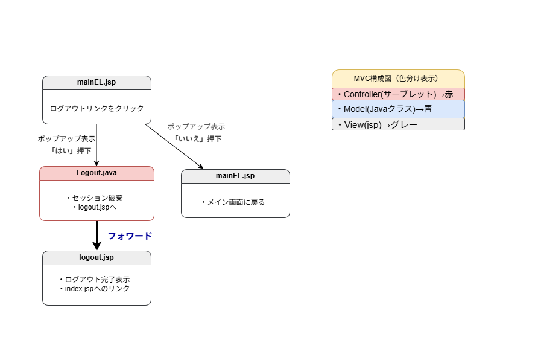

# ログアウト処理設計書

## 1. 概要

ログイン中のユーザーが「ログアウト」を選択した際に、セッションを破棄し、  
ログイン画面へ戻るまでの流れを示す設計書です。

---

## 2. ログアウト処理フロー（MVC構成）

**色分け情報：**
- Controller（サーブレット） → 赤  
- Model（Javaクラス） → 青  
- View（JSP） → グレー  

### 2-1. フロー図

※ 画像をクリックすると拡大表示されます。

---

## 3. 処理概要（順序付き）

1. ユーザーが `mainEL.jsp` で「ログアウト」リンクをクリック  
2. JavaScript ポップアップが表示され、「はい」「いいえ」を選択  
   - 「はい」 → `Logout.java` へ遷移  
   - 「いいえ」 → `mainEL.jsp` に留まる  
3. `Logout.java` にて以下の処理を実行  
   - セッションを破棄（`session.invalidate()`）  
   - `logout.jsp` へフォワード  
4. `logout.jsp` で以下を表示  
   - 「ログアウトしました」メッセージ  
   - 「index.jsp」へのリンク（再ログイン用）

---

## 4. 画面構成

| 画面名       | ファイル名       | 役割                                |
|---------------|------------------|-------------------------------------|
| メイン画面    | `mainEL.jsp`     | ログアウトリンクを表示              |
| ログアウト処理 | `Logout.java`    | セッション破棄・フォワード処理担当 |
| 完了画面      | `logout.jsp`     | 完了メッセージ＋ログイン誘導表示   |

---

## 5. 処理詳細

| 処理対象 | 処理内容 | 備考 |
|-----------|-----------|------|
| セッション | `session.invalidate()` | 全ユーザー情報削除 |
| 遷移      | `RequestDispatcher` により `logout.jsp` へフォワード |  |
| 表示内容  | 「ログアウトしました」＋「ログイン画面へ戻る」リンク |  |

---

## 6. ポイントまとめ

- **安全性:** セッションを確実に破棄し、再アクセス時は再ログイン必須。  
- **ユーザビリティ:** 確認ポップアップで誤操作防止。  
- **設計方針:** MVC構成に基づき、処理は `Logout.java` に集約。

---
