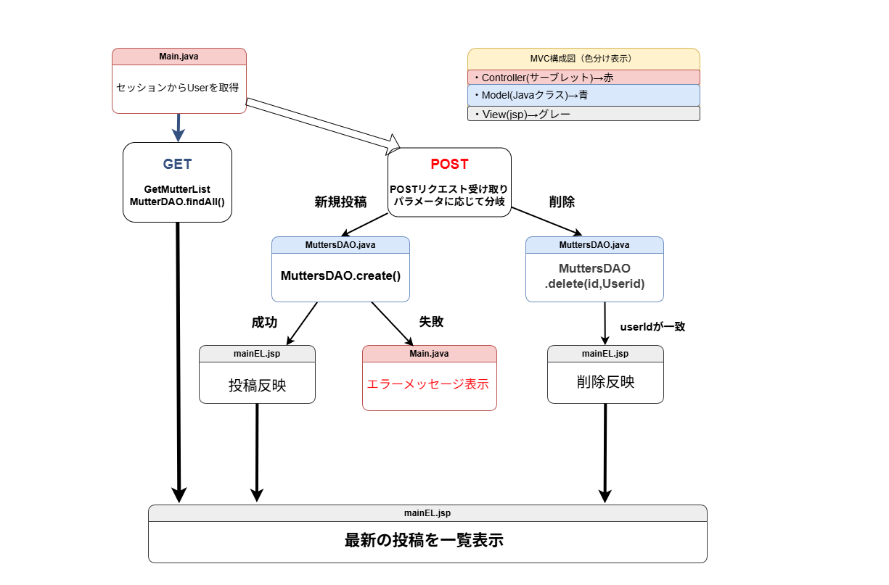

# 投稿・削除処理設計書

## 1. 概要

ユーザーがメイン画面で投稿を行う、または自分の投稿を削除する際の処理の流れを示す設計書です。  
本処理は、セッション情報をもとにユーザーを特定し、DAO経由でデータベースにアクセスします。

---

## 2. 投稿・削除処理フロー（MVC構成）

**色分け情報：**
- Controller（サーブレット） → 赤  
- Model（Javaクラス） → 青  
- View（JSP） → グレー  

### 2-1. フロー図

※ 画像をクリックすると拡大表示されます。

---

## 3. 処理概要（順序付き）

### 投稿処理の流れ

1. ユーザーが `mainEL.jsp` の投稿フォームに入力し、送信ボタンを押下  
2. `Main.java`（Controller）で以下を実行  
   - セッションから `User` を取得  
   - 投稿内容（`text`）をリクエストパラメータから取得  
   - 空文字チェックを行い、問題なければ `MutterDAO.create()` を呼び出し  
3. `MutterDAO.create()`（Model）で投稿をDBに登録  
4. 投稿完了後、`Main.java` で再度 `MutterDAO.findAll()` を呼び出し、最新一覧を取得  
5. 投稿結果を `mainEL.jsp`（View）にフォワードし、画面に反映  

---

### 削除処理の流れ

1. ユーザーが自分の投稿に表示された削除ボタンをクリック  
2. `Main.java`（Controller）で以下を実行  
   - リクエストパラメータから `mutterId` を取得  
   - セッション内の `User` 情報を取得し、投稿者のIDと一致確認  
   - 一致する場合は `MutterDAO.delete(mutterId, userId)` を呼び出し  
3. `MutterDAO.delete()`（Model）で対象レコードを削除  
4. 処理結果に応じて `mainEL.jsp` にフォワード  
5. 最新一覧を再取得し、削除後の投稿リストを表示  

---

## 4. 画面構成

| 画面名       | ファイル名       | 役割                                 |
|---------------|------------------|--------------------------------------|
| メイン画面    | `mainEL.jsp`     | 投稿フォーム・投稿一覧・削除ボタンを表示 |
| 投稿・削除処理 | `Main.java`      | 投稿・削除の制御とDBアクセス指示       |
| DAO           | `MutterDAO.java` | 投稿の登録・削除処理をDBと連携         |

---

## 5. 処理詳細

| 処理対象 | 処理内容 | 備考 |
|-----------|-----------|------|
| 投稿内容 | `text` パラメータを取得、空チェック後にDB登録 | `MutterDAO.create()` 呼出 |
| 削除要求 | 投稿IDとユーザーIDを照合して削除実行 | `MutterDAO.delete()` 呼出 |
| 表示更新 | 処理後に `findAll()` で一覧再取得 | 投稿・削除後どちらも共通 |

---

## 6. ポイントまとめ

- **データ整合性:** 投稿者本人のみ削除可能。  
- **再描画:** 投稿・削除後ともに最新一覧を再取得して即時反映。  
- **例外処理:** 入力値が空の場合はエラーメッセージを表示。  
- **設計方針:** 投稿・削除とも `Main.java` に集約し、Model層はDB操作に特化。

---
